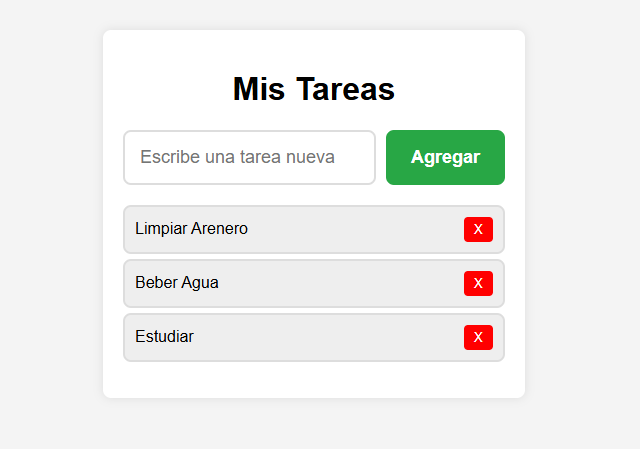

# To-Do List en JavaScript

Un proyecto simple para gestionar tareas diarias, creado para practicar manipulación del DOM y lógica de JavaScript.

## Funcionalidades:
- Agregar tareas dinámicamente.
- Marcar tareas (cambio de estilo visual).
- Eliminar tareas completadas.
- Diseño responsivo y amigable.

## Tecnologías
- HTML5
- CSS3 (Flexbox)
- JavaScript (ES6)

## Captura de pantalla

## Demo en vivo
[Ver proyecto aquí](https://mattlo9.github.io/js-todo-list/)